StudyMob 

### Robin Chang  
Anatoly Torchinsky  
Wylie Wong
  

## Table of Contents

    
1.  [Introduction][0]
1.  [The Team][1]
1.  [StudyMob][2]  
    
    3.1 [Login][3]  
    
    3.2 [Create an Account][4]  
    
    3.3 [Forgot Password][5]  
    
    3.4 [Main Menu][6]  
    
    3.5 [Map][7]  
    
    3.6 [Search StudyMobs][8]  
    
    3.7 [Mob Details][9]  
    
    3.8 [Create a StudyMob][10]  
    
    3.9 [View Account][11]  
    
    3.10 [Notifications][12]  
    
    
1.  [Future Plans][13]
    

  
  

## 1\. Introduction
[Back to the top][14]  

Welcome to Team Lincoln's StudyMob project for ECS 160 at UC Davis! StudyMob is an Android based application with the goal of bringing students together for the main purpose of forming study groups. With the widespread use of smartphones amongst university students today, StudyMob is **blah blah blah... continue later**.

  
  

## 2\. The Team
[Back to the top][14]  

### Robin Chang
Robin provided the team with the backend server and database for the application to communicate with. He also handled most of the server side coding with PHP and creating the database structure. For the Java side, Robin also figured out how to decipher the server responses that contained JSONObjects in array format.

### Anatoly Torchinsky
Anatoly was the main contributer to getting the Google Maps API up and running for our application. In addition to providing functionality with searching for StudyMobs using Google Maps, he also implemented the Asynchronous Tasks for activities which require some time to load information from the server before the starting the new activity. He also added functionality to the application, such as editing a user's account information, and the notifications page (mainly handled the invite notifications while Wylie handled the join request notifications).

### Wylie Wong
Wylie had roles on both the Android side and the server side. He and Anatoly provided a bulk of the functionality on the Android side. One of the key features that Wylie worked on was implementing the search for a Study Mob system. Another part of the project that he worked on was creating a new Study Mob, as well as producing the list of classes for a user to choose from while picking which classes they can provide expertise on and which classes they needed help on. Wylie also assisted Robin in handling the server side.

  
  

## 3\. StudyMob
And now, time to explore our application!

### 3.1 Login
[Back to the top][14]  
  

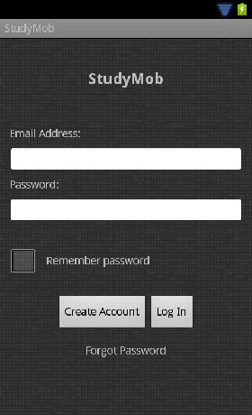  

**Figure 1:** Login Page
  
  

When the application boots up, the user shows up to the Login page right away. There are fields for the user to type in their email address and password in order to have their credentials verified before using StudyMob. Here is a general screenshot of how the page looks:  
  

This activity has a relationship with three other activities: Create an Account, Forgot Password, and Main Menu.  

    
*   If the user does not have an account with StudyMob, then they can click on the "Create Account" button to make one. This activity is further explained [here][4].
*   If the user forgets their password, they click on the "Forgot Password" link to begin the process of retaining access to their account. This activity is further explained [here][5].
*   If the user entered their correct login information and clicks on the "Log In" button, then a request that contains the user's credentials in a JSON Object is sent to the server for validation. If the server sends back a successful response, then the user has access to the Main Menu to interact with the application. This activity is further explained [here][6].
    

In our implementation of the application, whenever a user successfully logs into the application, we created a User class to store all of their account information (except the user's password of course). This User object is made public to the rest of the activities for this particular session for the application to access the currently logged in user's information.

### 3.2 Create an Account
[Back to the top][14]  
  

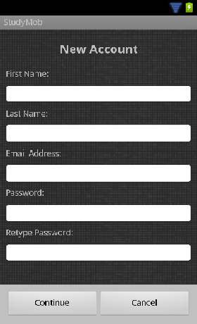
               
 
                
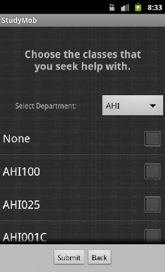  

**Figure 2:** Create an Account Page
                  
                
**Figure 3:** Set Providers
                  
                 
           
**Figure 4:** Set Consumers
  
  

The "Create an Account" page is accessed when a user needs to create an account to have access to the application. The goal of this page is for the user to fill out the form with their information to create a new account.
  
  

Each user is determined through the unique email address that they provide. If the server detects that there is already an account under the email provided, then the application will tell the user that they are not able to use that email to create a new account. Likewise, for the rest of the form, if the passwords in the two password fields don't match, an notification will pop up informing the user.
  
  

When the user completes this form, they are brought to the next step of creating their new account, which is to select the classes that they can provide help for and the classes that they need help with.
  
  

The user pretty much selects the classes for each respective situation (providing help for or seeking help) from the list generated by filtering the classes by department. After choosing the classes, the process of creating a new account is complete, and a notification is displayed informing the user that they can now log in with the email and password that they provided for the new account.

### 3.3 Forgot Password
[Back to the top][14]  

When a user forgets their password, and accesses this page, they can enter their email address in the provided field to begin the process of retrieving access to their account. The server receives this request and checks if the email is in the database. If not, then the user must create a new account. Otherwise, an email is sent to that email address with a randomly generated passcode for the user to access their account once again.

### 3.4 Main Menu
[Back to the top][14]  
  

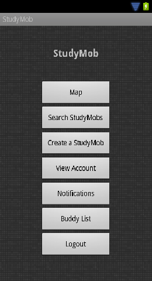  

**Figure 5:** Main Menu
  
  

The Main Menu is where all of the interaction with the application takes place. From here, the logged in user can navigate their way through the application and utilize its functionalities.
  
  

The pages that each button lead to will be described in their own respective sections (except for Buddy List since we do not have that functional yet). When the user selects the "Logout" option, they are brought back to the Login Page and the application clears the User object that stored the information of the logged in user.

    
*   [Map][7]
*   [Search StudyMobs][8]
*   [Create a StudyMob][9]
*   [View Account][10]
*   [Notifications][11]
    

### 3.5 Map
[Back to the top][14]  
  

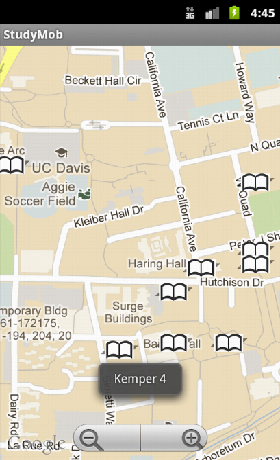 
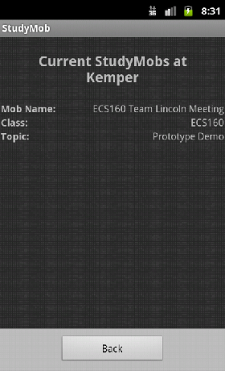  

**Figure 6:** Map
                  
                 
                 
          
**Figure 7:** Search Mobs by Map
  
  

In our application we implemented a nice little feature where the user can search for Study Mobs by the location of where the Study Mob is taking place. To do this, we made it so that the user can see the map of the general area using the Google Maps API. For each general location, there is an overlay image where the user can click on. One tap would display the name of the location along with the number of Study Mobs in that location. Two taps would direct the user to a list of Study Mobs for the location where the user committed the double tap. The user can then view the Study Mob details page for the Study Mob selected. So the Maps page has interactions with both the Main Menu page and the StudyMob details page. On select of the a Study Mob, the user would be redirected to the Mob's Detail Page, which can be explored further [here][9].  
  

### 3.6 Search StudyMobs
[Back to the top][14]  
  

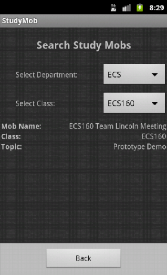  

**Figure 8:** Search Mobs by Class
  
  

In order for a user to search for a specific Study Mob, we have it so that the user must perform a search of the Study Mob according to which class the Study Mob is based on. To perform this search, the user needs to filter out what class that they want by first selecting the department for the class that they are looking for. This initial search will filter out all of the classes that belong in the department selected. These classes can be selected from the second dropdown menu, which is designated for selected the class. Once a class is chosen from the class drop down menu, a list of Study Mobs for that chosen class will be generated and displayed for the user to browse through those Study Mobs. On select of the a Study Mob, the user would be redirected to the Mob's Detail Page, which can be explored further [here][9].  
  

### 3.7 Mob Details
[Back to the top][14]  
  

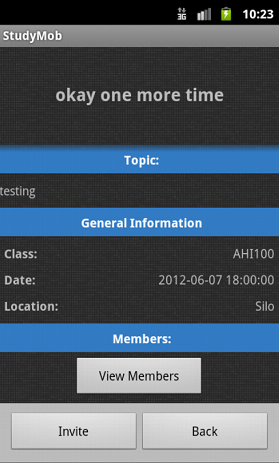
                  
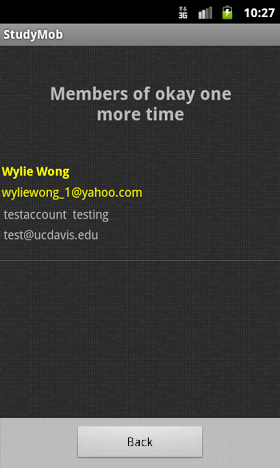
  

**Figure 9:** Mob Details
                  
                 
                
**Figure 10:** Members of the Mob
  
  

When a user arrives at the Mob Details page of their selected Mob, they are able to view all of its information and decide whether to Invite users to the Mob (if they are the owner of the Mob) or to Join or Leave the group depending on if they are a member or not. When they click on the "View Members" button, they are able to see who the current members are in the Mob (as shown in **Figure 10**).
  
  

### 3.8 Create a StudyMob
[Back to the top][14]  
  

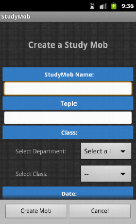  

**Figure 11:** Create a Study Mob
  
  

The user creates a new Study Mob by accessing this page through the Main Menu and filling out the required fields (some of it which is shown in **Figure 11**). To select the class for which the Study Mob is associated with, we once again used the Class filtering system with dropdown menus for the user to make their selection. Additionally, we added dropdown menus to select the starting date and time and ending date and time for the Study Mob. Restrictions are put on these times so that if the start time/date is later than the end time/date, the user is not able to create the Study Mob. On top of that, if the end time/date is earlier than the current date, then the user would not be able to create the Mob as well. These checks are done on the server's side through PHP script, after the user clicks on the "Create Mob" button and the application sends a request to the server.
  
  

### 3.9 View Account
[Back to the top][14]  
  

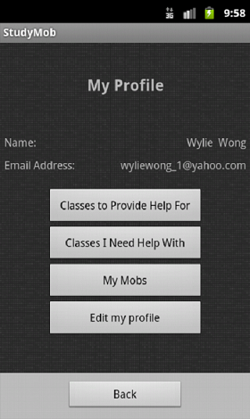
                  
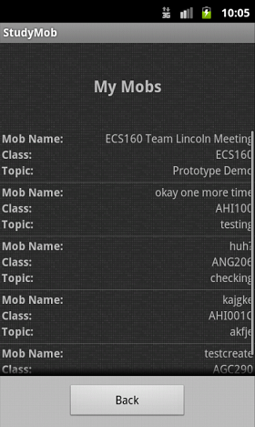
  

**Figure 12:** View Account
                  
                 
            
**Figure 13:** My Mobs
  
  

The View Account page allows the user to view their account details in addition to making necessary changes to the user's account information. There is a little submenu within this page that allows the user edit the classes to provide help for and the classes that the user needs help with. These pages will display (close to exactly) the same page as when the user first set up these classes when they created a new account. The difference this time is that the classes that have already been selected previously will show up with a checkmark already.
  
  

Through this submenu, the user is also able to view all of the current Mobs that they are a part of (whether they are the owner of the Mob or just a member of it). A list of these mobs are generated (as shown in **Figure 13**).
  
  

And lastly, the user is also able to edit their account information, which includes their name, email address, and password.
  
  

### 3.10 Notifications
[Back to the top][14]  
  

                 
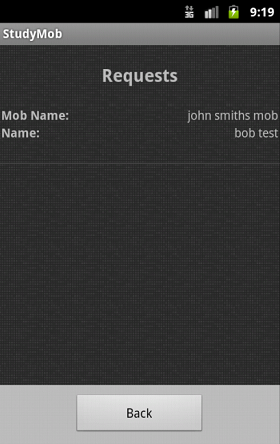
                 
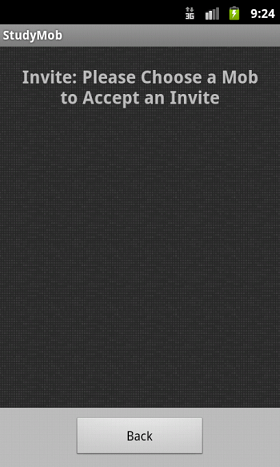
  

**Figure 14:** Notifications
                  
                 
             
**Figure 15:** Join Requests
                  
                 
             
**Figure 16:** Invitations
  
  

Here is the final feature that we implemented for StudyMob, which is to allow the logged in user to check their notifications. These notications are when people have sent requests to join a Study Mob that the user is an owner of, or when owners of other Study Mobs have invited the current user to join their Study Mob. Clicking on the "Join Requests" button will bring the user to a list of join requests to the user's group, where the user can choose to approve or deny the request to join their group. "Mob Invitations" on the other hand will bring the user to a list of invite requests, where the user can accept or deny the invitation to join another group.
  
  

## 4\. Future Plans
[Back to the top][14]  

StudyMob is still a work in progress, with a lot of new and exciting features that can be integrated into it. Currently, the layout of the application is very prototypical and has no design in it whatsoever. So some aesthetics can definitely be added on in the future. Secondly, we can add features such as remembering a user's password so that they would not need to type it in everytime they want to log in. One of the ideas that we had was to include a Buddy List system, where the users can keep track of who they study well with and find their buddies to study with.
  
  

Another idea that we had (we actually wanted to integrate this feature from the very beginning) was to design a Main Menu where the users can navigate to the main pages using a tabbed layout. The gist of this idea was so that there would be a general screen with three tabs on the top that read "Map," "Search Mobs," and "Create Mob." Within the screen will be the display for each of the three depending on which tab is selected. This way, we hoped to incorporate a more interactive environment for the user and make it a bit more aesthetically pleasing. However, we realized that this shouldn't be our first step, and that we should make sure that the user could navigate without problems first. Thus, we decided on first starting out with a generic Menu layout.
  
  

We would also like to incorporate GPS functionality with our Maps page so that the application can recognize the user's current location and display a list of Study Mobs that are relevant to the user around their current location.
  
  

# Thank you!

[0]: #1
[1]: #2
[2]: #3
[3]: #3-1
[4]: #3-2
[5]: #3-3
[6]: #3-4
[7]: #3-5
[8]: #3-6
[9]: #3-7
[10]: #3-8
[11]: #3-9
[12]: #3-10
[13]: #4
[14]: #TOC
